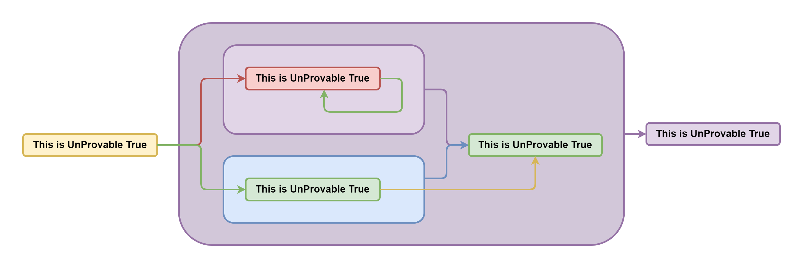
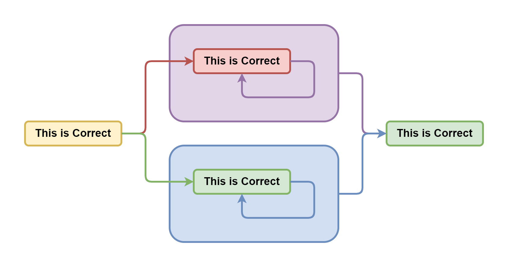
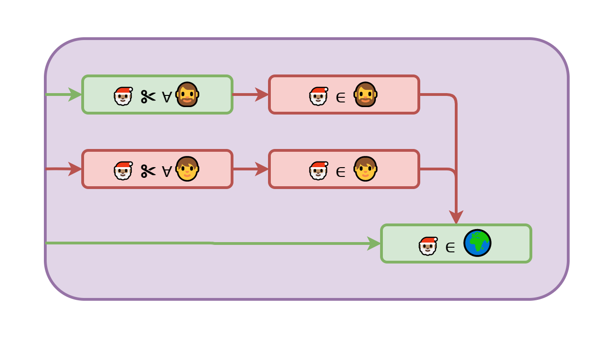
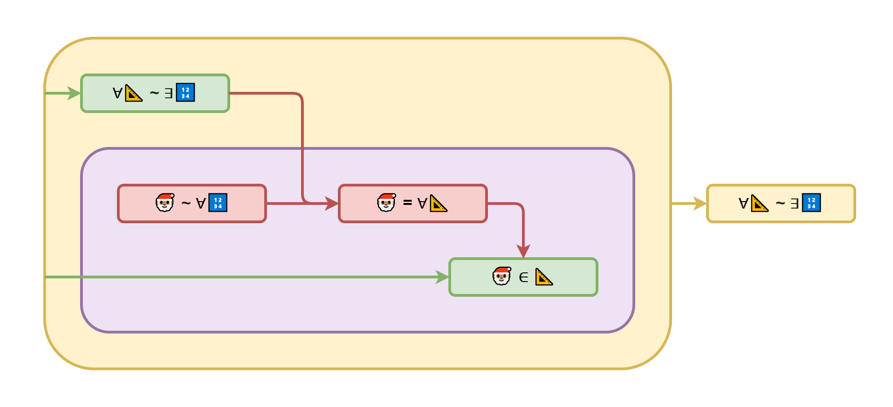
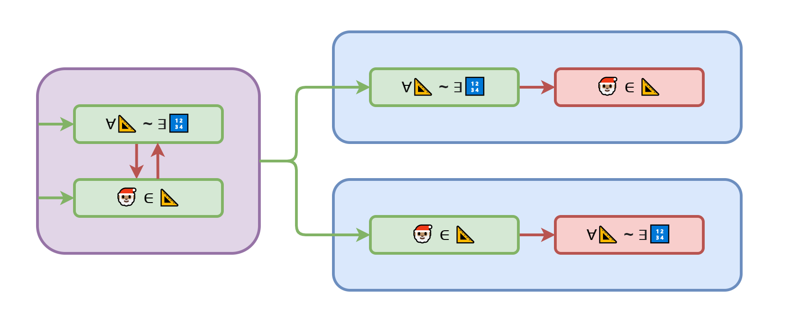
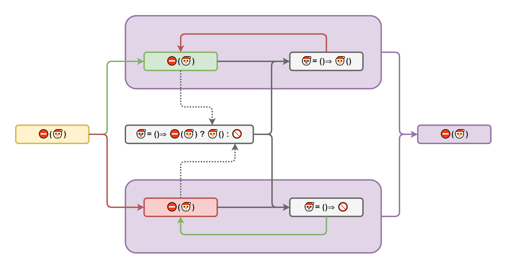
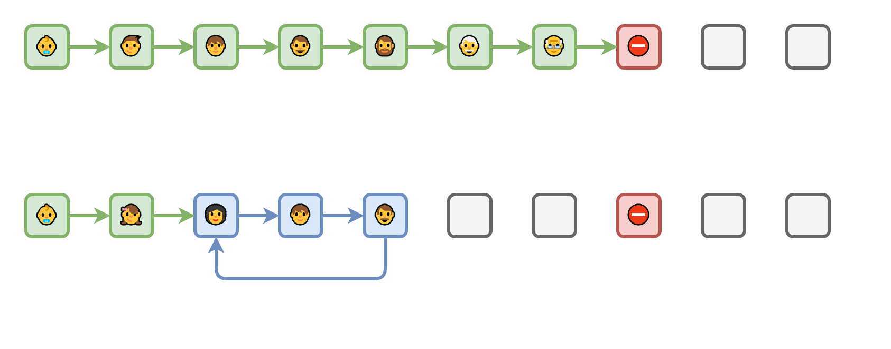

# Проблема останова лжеца Гёделя и брадобрея Кантора

Здравствуйте, меня зовут Дмитрий Карловский. А вы на канале "Core Dump", где мы берём различные темы из компьютерной науки и деконструируем их по полочкам.

А на этот раз мы разберём тему "абсурда" - почему он возникает и к каким странным последствиям приводит неосторожное обращение с ним. Докажем, что Санты не существует. Научимся пересчитывать линейки. Остановим временную петлю. И элегантно преодолеем столетний кризис оснований математики.

Так что забирайтесь в кроличью нору - вас ждёт короткое, но увлекательное приключение.

Вы можете [читать это как статью](https://github.com/nin-jin/slides/blob/master/absurd/readme.md), либо [открыть в интерфейсе проведения презентаций](https://nin-jin.github.io/slides/absurd/).

## Классическая логика

Начнём с самых основ. Какие бывают утверждения?

В рамках классической логики они бывают либо правдивыми, либо ложными. Обозначим их соответственно зелёным и красным цветами.

## Многозначная логика

Однако, важно понимать, что понятие истинности применимо лишь для корректных утверждений, то есть имеющих какой-то смысл.

Если же утверждение является не корректным, то оно не может быть ни правдивым, ни ложным. Ведь это бессмыслица, не несущая в себе никакой содержательной информации. Например, можно ли сказать правдиво или ложно выражение `2 = +`? Это вообще не понятно что такое. В то же время одинокое высказывание `A = B` может быть и правдивым, и ложным, но без понимания, что скрывается за `A` и `B` невозможно сказать наверняка. 

Обозначим корректные утверждения голубым, абсурдные - фиолетовым, а суждения, истинность которых не известна, - жёлтым. Таким образом мы получили так называемую четрырёхзначную логику, позволяющую однозначно классифицировать любые типы утверждений исходя из доступной касательно них информации.

## Четыре значения истинности

Но почему именно 4 значения нужно, чтобы классифицировать любые утверждения? Дело в том, что это число всех возможных пересечений двух бинарных параметров: может ли утверждение быть правдой и может ли оно быть ложью.

Именно поэтому не бывает, например, пятеричной логики. А вот троичные бывают - они либо удаляют одно из приведённых тут значений из рассмотрения, либо объединяют абсурд и неопределённость в одно значение - "некорректность".

## Доведение до абсурда

Давайте рассмотрим, как понятие корректности помогает нам делать логические выводы, на примере популярного в математике метода "доказательства от противного".

Пусть у нас есть уравнение: `2*2 = 2+2`. Правдиво оно или ложно?

Допустим, что оно ложно. Тогда после вычисления левой и правой частей мы получим, что суждение `4=4` тоже ложно. Однако, у нас есть аксиома тождества утверждающая, что любое число равно самому себе. Получаем противоречие: зелёная стрелка упирается в красный прямоугольник. То есть эта ветка рассуждений абсурдна и поэтому отбрасывается. А значит исходное уравнение не может быть ложным.

Но может ли оно быть правдивым? Что ж, рассмотрим и эту гипотезу. Из неё вытекает, что `4=4` тоже правдиво, что соответствует аксиоме тождества. И никаких противоречий не возникает. А значит эта ветка рассуждений вполне себе корректна. Таким образом мы доказали, что исходное уравнение не может быть ни чем иным, как правдой.

Может показаться, что проверка второй гипотезы уже лишняя, когда опровергнута первая. Ведь если утверждение не ложно, то оно должно быть правдиво. На этот счёт в классической логике даже есть отдельная аксиома "исключённого третьего". Однако, не стоит забывать, что произвольно взятое утверждение может оказаться не только правдивым или ложным, но и попросту некорректным. И в этом случае та аксиома не применима, как и вся классическая логика. Поэтому прежде чем брать такое утверждение в оборот классической логики, необходимо доказать его корректность. Ну либо всё же использовать не классическую, многозначную логику.

## Неполнота

Возьмём, для примера, выражение, утверждающее свою собственную правдивость и попробуем его проанализировать.

Если оно правдиво, то оно утверждает, что оно правдиво, что не противоречит исходному предположению. А если оно ложно, утверждая, что оно правдиво, значит оно ложно, что тоже подтверждает исходное предположение. Получается, что это утверждение не несёт в себе достаточно информации, чтобы определить его истинность. А значит его требуется дополнить ещё каким-то суждением, которое бы что-то говорило об истинности данного утверждения.

Конкретно в данном случае нам для полноты не хватает аксиомы, позволяющей установить истинность подобных утверждений. Звучать она может, например, так: выражения, утверждающие свою собственную правдивость, не корректны. Просто потому, что они не дают нам никакой полезной информации для дальнейших рассуждений. Назовём её "аксиомой Мюнхгаузена" в честь известного персонажа, вытаскивавшего самого себя из болота за волосы. 

## Парадокс лжеца

Но что если утверждение будет говорить о своей собственной ложности?

Если оно правдиво, то из его содержания следует, что оно ложно. Получаем противоречие и отбрасываем. Если же оно ложно, то из отрицания её содержания следует, что оно правдиво. Опять противоречие - снова выбрасываем.

Получается, что такое утверждение противоречиво само по себе, а значит некорректно. Оно не может быть ни правдой, ни ложью, независимо от любых других суждений. Такое утверждение является семантической бессмыслицей, также известной как "парадокс лжеца". И из неё нельзя сделать никаких содержательных выводов, кроме того, что оно абсурдно.

## Это - абсурд

Может показаться, что мы не разрешили парадокс, а лишь убежали от него. И если заменить ложность на абсурдность, то парадокс вернётся вновь. Но давайте рассмотрим и выражение "это утверждение абсурдно".

Из его правдивости следует его же абсурдность, что является абсурдом. Однако, из его ложности следует его корректность, что не вызывает противоречий. Получается, что оно вполне корректно, но ложно. И никаких парадоксов не возникает.

## Первая теорема Гёделя о неполноте

Ладно, давайте разберём что-то по сложнее. Например, первую теорему Гёделя о неполноте. Суть её сводится к тому, что в любой непротиворечивой системе утверждений существует такое правдивое утверждение, которое невозможно доказать. То есть эта система не полна. Для обоснования приводится выражение вида "это выражение невозможно доказать". Давайте проанализируем его, как мы умеем..

Если оно ложно, значит доказать его всё же можно. А если можно доказать, то оно правдиво. Противоречие - отбрасываем. Если же оно правдиво и непротиворечиво, а ложность мы уже отвергли, то получается, что мы его доказали. А оно говорит о своей недоказуемости. Опять противоречие - снова отбрасываем. А так как мы только что доказали, что оно не может быть ни правдивым, ни ложным, значит оно абсурдно.

Тут Гёдель заявляет, что мы же не смогли доказать утверждение, которое говорит о своей собственной недоказуемости, что получается правда и теорема как бы доказана. Однако, тут важно помнить, что невозможность правдивости мы уже только что показали. А суть тут в том, что понятие истинности (и как следствие доказуемости) в принципе не применимо к абсурдным утверждениям.

Это всё равно, что спрашивать "Когда вы перестали пить по утрам?" у человека, который в жизни в рот не брал. По сути, выражение Гёделя - не более чем слегка завуалированный парадокс лжеца, где утверждение эффективно отрицает само себя. Важный вывод из этих рассуждений заключается в том, что введение в рассуждение абсурдного утверждения не поможет ничего доказать или опровергнуть, кроме собственно абсурдности этого утверждения. 

## Вторая теорема Гёделя о неполноте

У того же Гёделя есть и другая теорема, утверждающая, что в любой непротиворечивой системе утверждений недоказуемо утвреждение о её непротиворечивости. Для "доказательства" он использует то же самое абсурдное утверждение, которое мы разобрали ранее. Поэтому, вместо очередного опровержения некорректных рассуждений, давайте просто докажем утверждение о собственной непротиворечивости...

Если утверждение "эта система утверждений корректна" ложно, то система утверждений не корректна, то есть противоречива. Если же это утверждение - правда, то система утверждений корректна, что не вызывает противоречий. Соответственно это утверждение не может быть ни чем иным как правдой.

Получается, что четырёхзначная логика, в отличие от классической, позволяет строить непротиворечивую, но при этом полную систему утверждений, позволяющую использовать её в качестве фундамента для математики. Ведь она позволяет однозначно выводить одно из четырёх возможных логических значений. А теоремы Гёделя просто показывают несостоятельность классической логики.

## Разбиение множества по предикату

Поднимемся на уровень выше, к теории множеств, где мы можем образовывать подмножества используя произвольный предикат, то есть функцию, которая возвращает правду или ложь. Возьмём, например, предикат "стрижёт" и разделим всё население Земли на тех кто стрижёт сам себя и тех, кого стригут другие. Первых обозначим бритой рожицей так как они могут себе позволить стричься хоть каждый день. А вторых - заросшей, так как для них сходить к цирюльнику - это целая эпопея.

Так как мы разделили всё население по предикату на два подмножества, то так же верны и утверждения, что объединение этих подмножеств равно всему населению планеты. А пересечение является пустым множеством, ибо никто не может и стричь себя сам, и не стричь одновременно.

## Введение определений

Теперь давайте представим себе такого персонажа, который стрижёт всех и только тех жителей, кто не стригут себя сами. Назовём его Сантой и формализуем его определение в виде системы из 3 утверждений..

Сначала мы утверждаем, что он принадлежит множеству населения Земли. Потом, что он стрижёт любого землянина, что не стрижёт себя сам. И наконец, он не стрижёт никого из тех, кто и сам себя не прочь постричь.

Но что за дела? Почему определение завёрнуто в жёлтый прямоугольник неопределённости? Как же так?

## Парадокс брадобрея

Дело в том, что прежде чем вводить в рассуждения новое определение, необходимо доказать, что оно корректно, то есть описывает то, что действительно может существовать, а не является абсурдом. Давайте попробуем это сделать..

Если любого, кто не стрижёт себя сам, стрижёт Санта, то сам Санта не может входить в это множество ибо тогда Санте пришлось бы стричь самого себя. С другой стороны, раз он не стрижёт никого из самостригущихся, значит сам он тоже не принадлежит к самостригущимся. Объединяя оба вывода, получаем, что.. Санты не существует, как это ни печально. Однако, он должен существовать исходя из нашего определения.

Получается, что система из 3 утверждений входящих в определение Санты противоречиво само по себе и не может использоваться для введения такой сущности в рассуждения. Такое абсурдное определение называется "парадоксом брадобрея" и имеет множество различных вариаций. А важный вывод из него заключается в том, что не всё, что можно описать может действительно существовать. Поэтому вводя новые сущности всякий раз необходимо доказывать непротиворечивость их описания.

## Несчётные множества

Давайте подумаем, что будет, если мы не будем отвергать абсурдные определения. Для этого рассмотрим теорему Кантора о несчётности вещественных чисел. Для наглядности, обозначим множество вещественных чисел как линейку, а множество натуральных как циферки в квадрате.

Вкратце, доказательство Кантора выглядит так: предположим, что для любого вещественного числа существует соответствующее ему уникальное натуральное число. Теперь введём в рассмотрение Санту - некоторое вещественное число, которое по построению не соответствует ни одному натуральному. А в рамках исходной гипотезы его определение эквивалентно седующему: Санта - это такое вещественное число, которое не равно никакому вещественному числу.

Получается, что Санта сам не может быть вещественным числом. Однако, ранее мы постулировали, что такой Санта среди вещественных чисел есть. И тем самым, кстати, нарушили один из основных принципов доказательства от противного - недоказуемая посылка в нём может быть только одна - которая далее и опровергается. А в "доказателстве" Канора их две - одна явная, а другая не очень.

## Направления математики

Получившееся противоречие означает, что невозможно одновременное существование Санты и соответствия между нашими множествами. Чтобы его разрешить, можно, например, признать, что такой самоотрицающий себя Санта существовать не может, а значит множество вещественных чисел счётно и все бесконечности равны. 

Ну а можно заявить, что если мы смогли Санту описать, значит он существует. А следовательно не существует соответствия, и одна **без**конечность, внезапно, может быть больше другой **без**конечности. Как минимум на один элемент. А это открывает широкие горизонты для целого математического направления с ординалами, кардиналами и прочими универсумами. Именно так и поступил Кантор, а вслед за ним и вся формалистская школа математики, породив тем самым несчётное множество парадоксов.

Отмечу, однако, почему это тупиковый вектор развития. В окружающем нас мире всё конечно. Поэтому алгебра бесконечностей принципиально бесполезна с практической точки зрения. Так что её можно безболезненно удалить бритвой Оккама и получить стройную непротиворечивую математику не опирающуюся на абсурдные сущности.

## Пересчитываем действительные числа

Ну ок, мы показали, что вещественные числа пересчитать всё же можно. Но как именно это сделать? Давайте сформулируем самый простой алгоритм..

Возьмём пустой ряд вещественных чисел и начнём заполнять его так: берём случайное вещественное число и проверяем есть ли оно уже в нашем ряду. Если оно уже есть - генерируем новое. И так далее, пока не встретим число, которое ещё не посчитали. Добавляем его в конец ряда и всё по новой.

Понятно, что для произвольного вещественного числа вероятность получить именно его на очередной итерации бесконечно мала. Но так как у нас есть неограниченное число попыток, то математическое ожидание, что оно нам попадётся в ряду хотя бы раз, равно единице. А это значит, что для каждого вещественного числа неизбежно будет получен уникальный натуральный номер в ряду. А следовательно, все бесконечные множества равны между собой по своей мощности.

## Проблема останова

Наконец, мы добрались до проблемы останова. Суть её заключается в том, чтобы написать такой анализатор, который бы для любого алгоритма мог сказать завершится тот когда-нибудь или же будет исполняться бесконечно долго. Сотню лет назад Алан Тьюринг доказал невозможность существования такого алгоритма. И я думаю вы уже понимаете каким вымышленным персонажем он для этого воспользовался.

Итак, предположим, что такой анализатор существует и обозначим его знаком "стоп". Он принимает произвольный алгоритм и возвращает флаг истинности. Теперь напишем нашего Санту таким образом, что он вызывает анализатор на самом себе и поступает ровно противоположно его решению: уходит в бесконечную рекурсию, если анализатор говорит, что алгоритм останавливается, но успешно завершается, если анализатор говорит, что остановки не произойдёт.

Понятное дело, что анализатор на таком алгоритме не сможет вернуть ни правду, ни ложь, так как Санта сформулирован в форме абсурда. Значит такого анализатора не существует? Да нет же, существовать он может, но должен бросить ошибку, так же как и для любого другого некорректного кода. В данном же случае текст ошибки может быть примерно такой: "алгоритм не корректен, так как его поведение зависит от результата работы анализатора".

По сути, рассуждения Тьюринга говорят нам не о том, что анализатора быть не может, а то, что классической (бинарной) логики не достаточно для представления результата его работы - нужна как минимум троичная, в которой представим в том числе и вердикт о некорректности кода.

## Проверка останова

Что ж, сформулируем простейший и максимально неэффективный анализатор останова. Для начала возьмём некоторый конечный объём памяти и заметим, что число возможных состояний этой памяти тоже конечно. А так как работа исполнителя целиком и полностью определяется состоянием памяти, то он неизбежно за конечное время придёт либо в терминиирующее состояние, либо в одно из состояний, в котором он уже был, и соответственно пойдёт по уже проложенному пути и будет делать так бесконечно долго.

Получается, всё, что нам нужно сделать - это исполнить алгоритм, на каждом шаге запоминая полное состояние памяти и сравнивая его со всеми предыдущими состояниями. Как только состояния совпадут - говорим, что алгоритм не останавливается.

Однако, машина Тьюринга, в отличие от любой реальной машины, обладает бесконечным объёмом памяти, что не позволяет вот так вот влоб за конечное время проверить остановимость алгоритма. Тут уже потребуется анализ потока исполнения для ответа на вопрос: "окажется ли указатель исполнителя за пределами произвольно заданного диапазона памяти". Если ответ утвердительный, то по индукции следует, что алгоритм никогда не остановится. Если же отрицательный, то задача сводится к варианту с конечной памятью.

Можно ли написать такой анализатор, определяющий выход за границы памяти, - вопрос хороший и ответа на него у меня сейчас нет. Возможно именно вы сможете на него ответить? Только чур не ссылаться на Санту!

## Резюме

На этом мы пока что остановимся и резюмируем сделанные выводы..

- Самоотрицание не продуктивно.
- Через абсурд ничего не доказать.
- Классическая логика ограничена.
- Четырёхзначная логика лишена парадоксов.
- Все бесконечности равны.
- Проверить остановку - не проблема.
- Математика свернула не туда.

Самоотрицание само по себе не позволяет что-либо доказать или опровергнуть. Оно лишь показывает ограниченность классической логики, не позволяющей оперировать абсурдными утверждениями. А вот четырёхзначная логика позволяет. Так что в ней логические парадоксы в принципе не возникают, что делает её отличным кандидатом для непротиворечивого, но при этом полноценного фундамента математики, где все бесконечности равны, любое утверждение можно вывести, а любой алгоритм можно проанализировать. Но, к сожалению, математика как свернула не туда, так там до сих пор и буксует. 

## Чтиво по теме

И тут вы, возможно, спросите меня: "Ты что тут самый умный что ли? Математики думаешь всё это не продумали? Иди книжки почитай!". И тут я с вами соглашусь. Чтобы глубоко понять проблематику нужно ознакомиться с её рассмотрением с разных сторон. А не только лишь с одной, господствующей на данный момент, школой математики. Ведь она не единственная. И математики до сих пор не пришли к консенсусу. Предпочитая скорее прятаться от проблем классической логики, чем решать их. Поэтому могу порекомендовать следующие материалы по теме..

- [Ошибка Георга Кантора / Зенкин АА](http://www.ccas.ru/alexzen/papers/vf1/vf-rus.html)
- [Логика с операторами истинности и ложности / Павлов СА](https://iphras.ru/uplfile/root/biblio/2004/Pavlov_Logika.pdf)

В работе Зенкина теорема Кантора рассматривается с несколько иных позиций, но результат такой же для неё плачевный. А в работе Павлова подробно разбирается четырёхзначная логика и её соотнесение с классической и другими близкими типами логик. 

# Продолжение следует..

> ✅ Лайк
> ✅ Подписка
> ✅ Комментарий
> ✅ Поделись-ка

Что ж. Пишите в комментариях, как сильно я не прав. Ставьте лайк, если хотите добавки. Подписывайтесь на канал, чтобы её не пропустить. И конечно же, делитесь ссылкой со знакомыми математиками, пусть они тоже поугарают.

А на этом пока что всё. С вами был абсурдный программер Дмитрий Карловский. 
