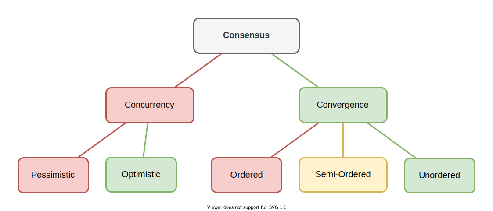
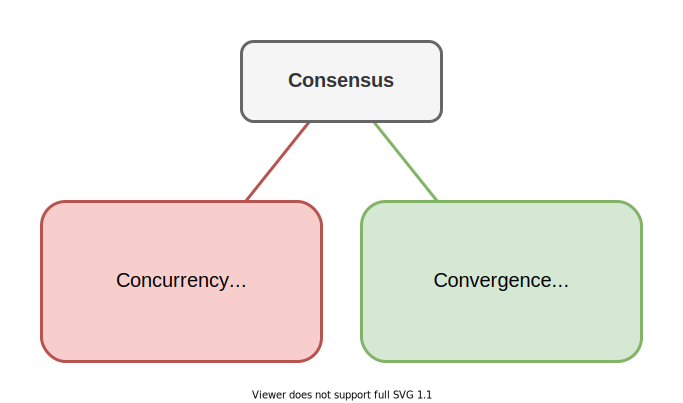
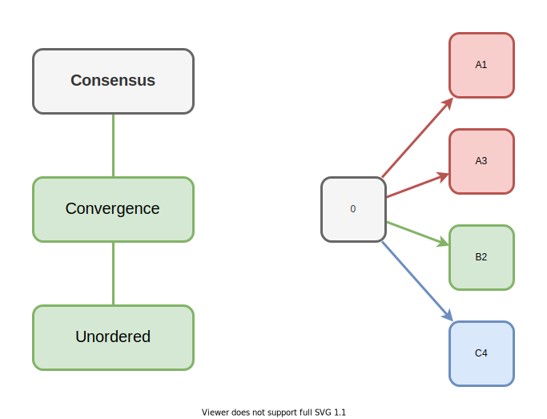

# Консистентно о Консенсусе

Здравствуйте, меня зовут Дмитрий Карловский. А вы на канале [Core Dump](https://www.youtube.com/channel/UC-qEImMrqSLZ9KLee1JTcuw), где мы берём различные темы из компьютерной науки и раскладываем их по полочкам.

И на этот раз мы постараемся прийти к согласию касательно согласованной классификации алгоритмов обеспечения консенсуса в системах со множеством участников. И попробуем выявить их фундаментальные особенности, проявляющиеся на разных масштабах: от ядер процессора, до серверных кластеров.

Вы можете [читать это как статью](https://github.com/nin-jin/slides/tree/master/consensus), либо [открыть в интерфейсе проведения презентаций](https://nin-jin.github.io/slides/consensus/).

## Consistency: Согласованность данных узла

## Consensus: Согласие между участниками

## Concurrency: Конкуренция за источник истины

## Pessimistic Blocking: Пессимистичная блокировка

## Optimistic Blocking: Оптимистичная блокировка

## Convergence: Сходимость к согласию

## Упорядоченная конвергенция

> OT: Operational Transformation

## Полу-упорядоченная конвергенция

> CmRDT: Conflict-free Commutative Replicated Data Type

## Беспорядочная конвергенция

> CvRDT: Conflict-free Convergent Replicated Data Type

## Согласны?

## Продолжение следует..

> ✅ Лайк
> ✅ Подписка
> ✅ Комментарий
> ✅ Поделись-ка

А на этом пока что всё. С вами был беспорядочный программер Дмитрий Карловский.