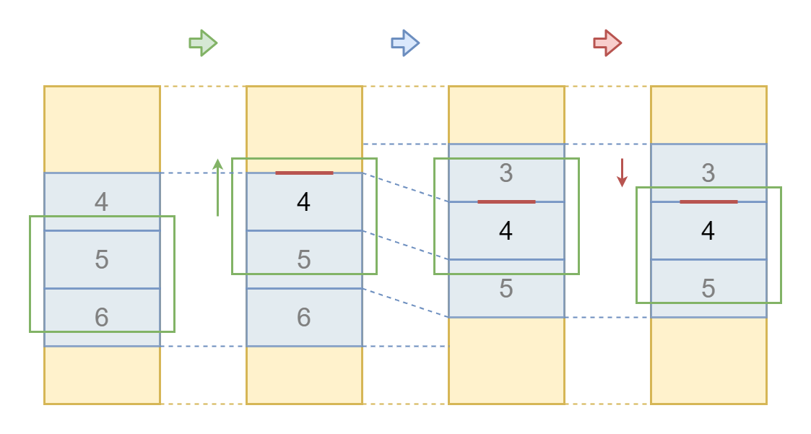
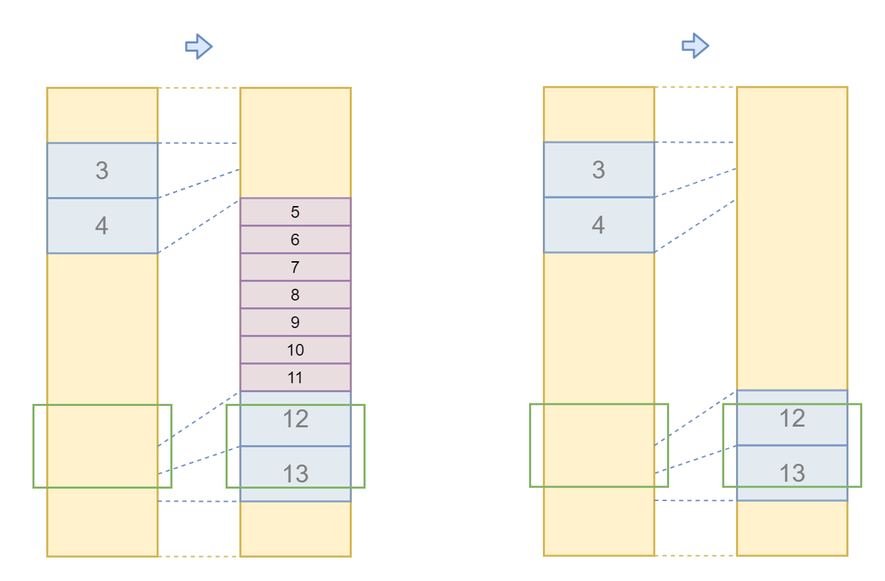

# Автоматическая виртуализация рендеринга произвольной вёрстки

Здравствуйте, меня зовут дмитрий Карловский и я.. прибыл к вам из недалёкого будущего. Недалёкого, потому что там уже всё и все тормозят. Писец подкрался к нам незаметно: сначала перестали расти моности компьютеров, потом пропускная способность сетей. А пользователи... они продолжали генерировать контент как не в себя. В итоге, за считанные годы UX интерфейсов деградировал настолько, что ими стало настолько пользоваться и многие пользователи поспешили перейти на облачный стриминг своих браузеров, которые работают на суперкомпьютерах, принадлежащих корпорациям, которые не дают людям устанавливать в них блокировщики рекламы. Поэтому я пришёл к вам именно сейчас, в этот момент, когда ещё можно всё исправить, пока не стало слишком поздно. 


[Дмитрий Карловский @ HolyJS'20 Moscow](https://holyjs-moscow.ru/)

Вы можете либо [посмотреть видео запись](), либо [открыть в интерфейсе проведения презентаций](https://nin-jin.github.io/slides/virt/), либо [читать как статью](https://github.com/nin-jin/slides/blob/master/virt/readme.md)...

# О чём это всё


Я делал иерархические списки задач на 40К штук, редактор документов на 200 страниц, и даже запилил фреймворк, где виртуализация происходит автоматически. Короче, съел я на той теме собаку, кошку, хорька, енота и даже морскую свинку. Так что далее я расскажу как эффективно предоставлять пользователю огромные объёмы данных, почему вообще возникает такая необходимость, какие технологии нам с этим могут помочь, и почему Реакт не способен избавить нас от головной боли.

# Типичный цикл разработки

- Написали код
- Проверили в типличных условиях
- Пришли пользователи и всё заспамили

# Наивный рендеринг: Скорость загрузки и Отзывчивость


# Наивный рендеринг: Потребление памяти


# Наивный рендеринг: Риск неработоспособности

- не влезли по памяти - приложение закрывается
- обрыв соединения - страница обрывается
- браузер может заглючить на больших объёмах

# Наивный рендеринг: Резюме

- Медленная загрузка
- Плохая отзывчивость
- Высокое потребление памяти
- Риск неработоспособности

# Перенос рендеринга HTML на сервер


# Оптимизации вёрстки

> *быстрее, но асимптотика не меняется*

# Прикладная оптимизация: Пагинация

> *пример*

# Прикладная оптимизация: Экспандеры

> *пример*

# Прикладная оптимизация: Бесконечный скролл

> *пример*

# Прикладная оптимизация: Вирт скролл

> *пример*

# Прикладная оптимизация: Резюме

- Пагинация
- Экспандеры
- Бесконечный скролл
- Вирт скролл

# Оптимизация инструментов: Тайм слайсинг

> *пример*

# Оптимизация инструментов: Прогрессивный рендеринг

> *пример*

# Оптимизация инструментов: Ленивый рендеринг

> *пример*

# Оптимизация инструментов: Виртуальный рендеринг

> *пример*

# Оптимизация инструментов: Резюме

1. Тайм слайсинг 
2. Прогрессивный рендеринг
3. Ленивый рендеринг
4. Виртуальный рендеринг
5. Виртуальный рендеринг

# Оптимизации: Резюме

| Оптимизация    | Стоит того?
|----------------|---
| Вёрстка        | ❌
| Прикладной код | ❌
| Инструментарий | ✅

# Оптимизация браузера: content-visibility

```css
content-visibility: auto;
contain-intrinsic-size: 1000px;
```

# Проблема: Оценка размеров

- Точная
- Минимальная
- Максимальная
- Усреднённая
- Последняя

# Типы компонент: Атомарный


# Типы компонент: Стек наложения


# Типы компонент: Вертикальный список


# Типы компонент: Горизонтальный список


# Типы компонент: Горизонтальный список с переносами


# Типы компонент: Грид

- Смотри горизонтальный список с переносами
- Только переносы заранее известны

# Объекты против функций

- Объект: одно состояние - много действий
- Функция: много состояний - одно действие

# Ортогональные ручки

- Узнать минимальные размеры
- Частично отрендерить содержимое
- Проверить соответствие поисковому запросу

# Логика рендеринга

- Измеряем положение
- Опрашиваем минимальные размеры
- Измеряем сколько куда нужно дорендерить
- Добавляем/удаляем элементы
- Для вложенных компонент повторяем рекурсивно

# Логика поиска

- Рекурсивно спускаемся по компонентам
- Отбираем соответствующие запросу
- Рисуем интерфейс перехода между найденным.

# Логика прокрутки

- Рекурсивно спускаемся по компонентам
- Форсируем рендеринг по пути до найденного
- Отложенно вызываем scrollIntoView на дом узле

# Пролема: скачки при скроллинге

- снизу менять DOM - полный штиль
- сверху менять DOM - дискотека авария

# Scroll Anchoring: Предотвращает скачки


# Scroll Anchoring: Выбор точки привязки

> *диаграмма*

# Scroll Anchoring: Подавление привязки

- top, left, right, bottom
- margin, padding
- Any width or height-related properties
- transform
- overflow-anchor: none

# Виртуализация: Прокрутка вниз


# Виртуализация: Прокрутка вверх



# Виртуализация: Расширение


# Виртуализация: Скачок вниз



# Виртуализация: Скачок вверх


# Scroll Anchoring: Поддержка

| Браузер | overflow-anchor
|---------|---
| Chrome  | ✅
| Firefox | ✅
| Safari  | ❌

# Scroll Anchoring: Запасный выход

```
const anchoring_support = CSS.supports( 'overflow-anchor:auto' )


if( anchoring_support ) {
    virtual render
} else {
    lazy render
}
```

# Проблема: Когда обновляться?

# Обновление на onScroll

# Обновление на IntersectionObserver

# Обновление на requestAnimationFrame

# Проблема: Долгая раскладка


# Аппаратное ускорение скролла

```
contain: content // for scroller


transform: translateZ(0) // for it's content
```

# Финальная версия


# Решаемые проблемы виртуализации

- Оценка будущих размеров
- Скачки контента
- Тормоза при скроллинге
- Прокрутка к элементу
- Поиск по странице

# Фундаментальные особенности

- Скачки скроллбара при неточной оценке размеров
- Scroll Anchoring может не работать в некоторых контекстах.
- Копирование выделенного текста.

# Бенчмарки: Скорость открытия и Отзывчивость


Сверху статья на Хабре. Мобильная версия. Меньше 200 комментариев без самой статьи рендерятся на VueJS. Снизу примерно то же самое на $mol. Отображается и статья, и комментарии. 

# Бенчмарки: Потребление памяти

| Вариант                           | Память JS                                             | Память вкладки
|-----------------------------------|-------------------------------------------------------|------------
| [VueJS: 170 комментариев](https://m.habr.com/post/522578)                                 | 50 MB     | 270 MB
| [$mol: статья + 170 комментариев](https://nin-jin.github.io/habrcomment/#article=522578/) | 8 MB      | 50 MB
| [$mol: статья + 2500 комментариев](https://nin-jin.github.io/habrcomment/#article=423889) | 40 MB     | 190 MB

# Бонус: Бесконечная виртуализация


# Ссылочки

- [Вырезаем SSR и ускоряем Хабр в 10 раз](https://habr.com/ru/post/514144/) - статья о виртуализации в $mol
- [nin-jin/slides/virt](https://github.com/nin-jin/slides/tree/master/virt) - эти слайды
- [habhub.hyoo.ru](https://habhub.hyoo.ru/) - другие мои статьи

# Обратная связь
